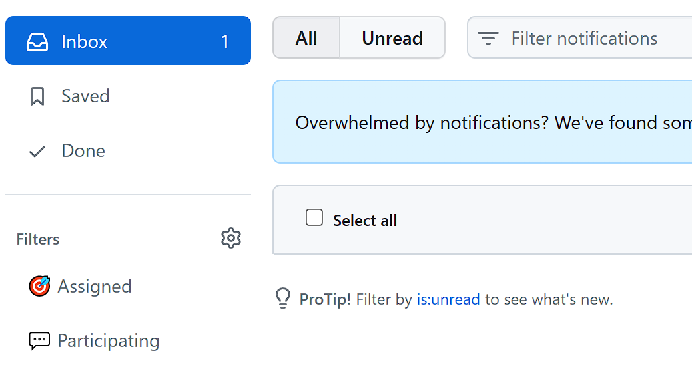

## Question

It seems GitHub may have buggy notifications that are not displayed in the list but keep showing on the inbox label.



## Solution

We can use GitHub cli and api to fix this.

### Login

```
~$ gh auth login
? What account do you want to log into? GitHub.com
? What is your preferred protocol for Git operations? HTTPS
? Authenticate Git with your GitHub credentials? Yes
? How would you like to authenticate GitHub CLI? Login with a web browser

! First copy your one-time code: xxxx-xxxx
- Press Enter to open github.com in your browser...

✓ Authentication complete. Press Enter to continue...

- gh config set -h github.com git_protocol https
✓ Configured git protocol
✓ Logged in as zouyonghao
```

### Check notifications

```
~$ gh api /notifications
[
  {
    "id": "5396807038",
    "unread": true,
    "reason": "subscribed",
    "updated_at": "2023-01-23T02:51:12Z",
    
    ...

  }
]
```

### Read the thread

```
~$ gh api /notifications/threads/5396807038 -X PATCH
~$ gh api /notifications
[]
```